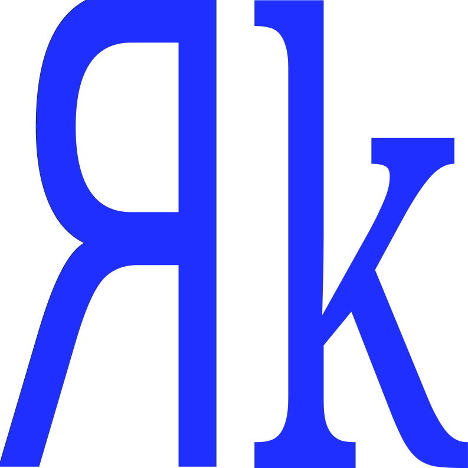

<a name="readme-top"></a>

<div align="center">
  
  <br/>

  <h3><b>Todo List using React Readme</b></h3>

</div>

<!-- TABLE OF CONTENTS -->

# 📗 Table of Contents

- [📖 About the Project](#about-project)
  - [🛠 Built With](#built-with)
    - [Tech Stack](#tech-stack)
    - [Key Features](#key-features)
  - [🚀 Live Demo](#live-demo)
- [💻 Getting Started](#getting-started)
  - [Setup](#setup)
  - [Prerequisites](#prerequisites)
  - [Install](#install)
  - [Usage](#usage)
  - [Run tests](#run-tests)
  - [Deployment](#triangular_flag_on_post-deployment)
- [👥 Authors](#authors)
- [🔭 Future Features](#future-features)
- [🤝 Contributing](#contributing)
- [⭐️ Show your support](#support)
- [🙏 Acknowledgements](#acknowledgements)
- [❓ FAQ (OPTIONAL)](#faq)
- [📝 License](#license)

<!-- PROJECT DESCRIPTION -->

# 📖 Todo List using React <a name="about-project"></a>

I developed this Todo List project using React. The core component is a minimalist Todo list created using React components. A User can,

<ol>
<li>Add a new task</li>
<li>View list of tasks</li>
<li>Update status of a task</li>
<li>Edit or delete an existing task</li>
</ol>

## 🛠 Built With <a name="built-with"></a>

### Tech Stack <a name="tech-stack"></a>

  <ul>
    <li><a href="https://reactjs.org/">React.js</a></li>
  </ul>

<!-- Features -->

### Key Features <a name="key-features"></a>


- **Minimalist Todo Application**

<p align="right">(<a href="#readme-top">back to top</a>)</p>

<!-- LIVE DEMO -->

## 🚀 Live Demo <a name="live-demo"></a>

A live demo of the web application is hosted on Github pages. Please use the following link to access the page.

- [Live Demo Link](https://ram1117.github.io/todolist-react/)

<p align="right">(<a href="#readme-top">back to top</a>)</p>

<!-- GETTING STARTED -->

## 💻 Getting Started <a name="getting-started"></a>

To get a local copy up and running, please follow these steps.


### Prerequisites

In order to run this project you need:

<ul>
<li>Node Js</li>
<li>github account</li>
<li>git CLI</li>
</ul>

### Setup

Clone this repository to your desired folder:


```sh
  cd my-folder
  git clone https://github.com/ram1117/todolist-react.git
  
```

### Install

To install all the project dependecies, execute the following commands:

```sh
  cd todolist-react
  npm install
```

### Usage

Once the dependecies are installed, please run the following command to start a local server,
that will render the pagein your browser.

```sh
  npm run start
```

### Run tests

No test cases have been added to the project, however you can add your test cases and test the project using jest test environment.

### Deployment

To deploy this project to your Github page, please follow the instructions in the below article:

[Deploy React project to Github Pages](https://ibaslogic.com/deploying-react-app-to-github-pages/)


<p align="right">(<a href="#readme-top">back to top</a>)</p>

<!-- AUTHORS -->

## 👥 Authors <a name="authors"></a>

👤 **Ram Kumar Karuppusamy**

- GitHub: [@ram1117](https://github.com/ram1117)
- Twitter: [@ram_karuppusamy](https://twitter.com/ram_karuppusamy)


<p align="right">(<a href="#readme-top">back to top</a>)</p>

<!-- FUTURE FEATURES -->

## 🔭 Future Features <a name="future-features"></a>

- [ ] **Add react routing functionality**

<p align="right">(<a href="#readme-top">back to top</a>)</p>

<!-- CONTRIBUTING -->

## 🤝 Contributing <a name="contributing"></a>

Contributions, issues, and feature requests are welcome! 

Please log bugs or feedbacks using GH issues. [issues page](https://github.com/ram1117/todolist-react/issues).

<p align="right">(<a href="#readme-top">back to top</a>)</p>

<!-- SUPPORT -->

## ⭐️ Show your support <a name="support"></a>

If you like this project, please provide a STAR to my [Github repo](https://github.com/ram1117/todolist-react)

<p align="right">(<a href="#readme-top">back to top</a>)</p>

<!-- ACKNOWLEDGEMENTS -->

## 🙏 Acknowledgments <a name="acknowledgements"></a>

I would like to thank [@Ibaslogic](https://twitter.com/ibaslogic) for their very clear React tutorial.
The tutorial can be accessed through [React Tutorial](https://ibaslogic.com/react-tutorial-for-beginners/)

<p align="right">(<a href="#readme-top">back to top</a>)</p>

<!-- FAQ (optional) -->

## ❓ FAQ (OPTIONAL) <a name="faq"></a>


- **Can I reuse/redistribute this project?**

  - The project is MIT licensed. Please refer to the License file for more information.

- **Can I contribute to this project? **

  - Yes, ofcourse. Please feel free to get in touch using my Social Media links above.

<p align="right">(<a href="#readme-top">back to top</a>)</p>

<!-- LICENSE -->

## 📝 License <a name="license"></a>

This project is [MIT](./LICENSE) licensed.

<p align="right">(<a href="#readme-top">back to top</a>)</p>
